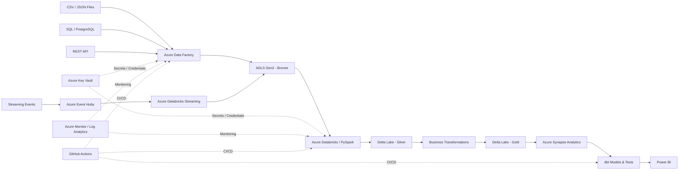

# Azure Healthcare Data Engineering Platform

An end-to-end **Healthcare Data Engineering project on Microsoft Azure** designed to simulate a real enterprise analytics platform. The project covers batch and streaming ingestion, medallion architecture, data quality, dimensional modeling, orchestration, warehousing, BI, monitoring, security, and CI/CD.

> **Important:** This project uses **synthetic healthcare data only**. No real patient or protected health information (PHI) should be stored in this repository or used in the pipelines.


# Project Goal

Build a production-style Azure healthcare analytics platform that can:

* Ingest healthcare data from files, databases, APIs, and event streams.
* Store raw data in **Azure Data Lake Storage Gen2**.
* Process data through **Bronze, Silver, and Gold** layers.
* Clean, validate, standardize, and deduplicate data using **Azure Databricks, PySpark, and Delta Lake**.
* Load analytics-ready data into **Azure Synapse Analytics**.
* Model warehouse data using **dbt**.
* Orchestrate workflows using **Azure Data Factory**.
* Build business dashboards in **Power BI**.
* Secure secrets using **Azure Key Vault**.
* Implement role-based access using **Azure RBAC**.
* Monitor pipelines using **Azure Monitor / Log Analytics**.
* Use **GitHub + GitHub Actions** for source control and CI/CD.

---

# Business Use Cases

The final platform supports analytics for:

* Patient visits and utilization
* Insurance claims
* Claim approval and rejection trends
* Provider performance
* Hospital cost analysis
* Diagnosis trends
* Prescription activity
* Readmission analysis
* Monthly healthcare KPIs
* Regional healthcare KPIs
* Patient utilization patterns

---

# High-Level Architecture



---

# Technology Stack

| Area                   | Technology                    |
| ---------------------- | ----------------------------- |
| Programming            | Python                        |
| Query Language         | SQL                           |
| Source Database        | PostgreSQL / Azure SQL        |
| Batch Orchestration    | Azure Data Factory            |
| Data Lake              | Azure Data Lake Storage Gen2  |
| Streaming              | Azure Event Hubs              |
| Data Processing        | Azure Databricks              |
| Distributed Processing | PySpark                       |
| Lakehouse Storage      | Delta Lake                    |
| Data Warehouse         | Azure Synapse Analytics       |
| Transformation         | dbt                           |
| BI / Reporting         | Power BI                      |
| Secrets Management     | Azure Key Vault               |
| Access Control         | Azure RBAC                    |
| Monitoring             | Azure Monitor / Log Analytics |
| Containers             | Docker                        |
| Version Control        | Git / GitHub                  |
| CI/CD                  | GitHub Actions                |

---

# Core Healthcare Datasets

The project uses synthetic versions of the following healthcare entities.

## Patients

```text
patient_id
first_name
last_name
date_of_birth
gender
city
state
insurance_id
created_timestamp
updated_timestamp
```

## Providers

```text
provider_id
provider_name
specialization
hospital_id
city
state
```

## Hospitals

```text
hospital_id
hospital_name
city
state
hospital_type
```

## Visits

```text
visit_id
patient_id
provider_id
hospital_id
visit_date
visit_type
diagnosis_code
```

## Claims

```text
claim_id
patient_id
visit_id
insurance_company
claim_amount
approved_amount
claim_status
claim_date
created_timestamp
updated_timestamp
```

## Prescriptions

```text
prescription_id
patient_id
provider_id
medicine_name
dosage
prescription_date
```

## Diagnoses

```text
diagnosis_code
diagnosis_description
diagnosis_category
```

---

# Source Systems

The project intentionally simulates multiple source systems.

```text
Patients        -> PostgreSQL / Azure SQL
Claims          -> CSV Files
Providers       -> REST API
Prescriptions   -> JSON Files
Hospitals       -> SQL Database
Visits          -> Azure Event Hubs
Diagnosis Codes -> Reference Files
```

This allows the team to learn how real enterprise platforms integrate different formats and technologies.

---

# Medallion Architecture

The data platform follows the **Bronze → Silver → Gold** architecture.

## Bronze Layer

The Bronze layer stores data almost exactly as received from source systems.

Typical responsibilities:

* Preserve original source data
* Store batch data
* Store streaming events
* Add ingestion timestamps
* Add source metadata
* Support replay
* Support reprocessing

Example:

```text
bronze/
    patients/
    claims/
    providers/
    hospitals/
    visits/
    prescriptions/
    diagnoses/
```

---

## Silver Layer

The Silver layer contains cleaned and standardized data.

Typical transformations:

* Remove duplicates
* Handle missing values
* Standardize date formats
* Validate IDs
* Correct data types
* Standardize state codes
* Validate diagnosis codes
* Validate provider references
* Validate patient references
* Quarantine invalid data

Example:

```text
silver/
    patients/
    claims/
    providers/
    hospitals/
    visits/
    prescriptions/
```

---

## Gold Layer

The Gold layer contains business-ready analytical datasets.

Example datasets:

```text
patient_claim_summary
provider_performance
hospital_cost_summary
monthly_claim_summary
patient_visit_summary
claim_rejection_summary
diagnosis_summary
insurance_performance
```

---

# Data Warehouse Design

The analytics warehouse follows a dimensional **Star Schema**.

## Dimension Tables

```text
DIM_PATIENT
DIM_PROVIDER
DIM_HOSPITAL
DIM_DATE
DIM_DIAGNOSIS
DIM_INSURANCE
DIM_MEDICATION
```

## Fact Tables

```text
FACT_CLAIMS
FACT_VISITS
FACT_PRESCRIPTIONS
```

Example relationship:

```text
                 DIM_PATIENT
                     |
                     |
DIM_PROVIDER --- FACT_CLAIMS --- DIM_INSURANCE
                     |
                     |
               DIM_DIAGNOSIS
                     |
                     |
                 DIM_DATE
```

---

# Data Quality Rules

Examples of validation rules implemented in the project:

```text
patient_id must not be NULL

claim_id must be unique

claim_amount >= 0

visit_date <= current_date

provider_id must exist

patient_id must exist

diagnosis_code must be valid
```

Claim status must be one of:

```text
Approved
Rejected
Pending
```

Invalid records should be written to quarantine/error locations rather than silently deleted.

Example:

```text
error/
    invalid_claims/
    invalid_patients/
    invalid_visits/
    duplicate_records/
```

---

# Incremental Loading

The system supports incremental processing.

Instead of reloading the entire dataset every day, only new or modified records are processed.

Fields used:

```text
created_timestamp
updated_timestamp
```

Example:

```text
Day 1

1,000,000 claim records

Day 2

8,000 new claim records
```

The Day 2 pipeline processes only the new or modified records.

---

# Slowly Changing Dimensions

The project implements **SCD Type 2** for selected dimensions such as patients and providers.

Example:

```text
patient_id | city      | effective_from | effective_to | is_current
P100       | Raleigh   | 2025-01-01     | 2026-05-01   | false
P100       | Charlotte | 2026-05-02     | NULL         | true
```

This preserves historical changes instead of overwriting older records.

---

# Streaming Pipeline

Real-time patient visit or claim events are published to:

**Azure Event Hubs**

and processed using:

**Azure Databricks Structured Streaming**

Streaming concepts covered:

* Event ingestion
* Consumer groups
* Structured Streaming
* Checkpointing
* Schema validation
* Late-arriving data
* Duplicate events
* Streaming-to-Delta writes
* Restart recovery
* Event processing monitoring

---

# Azure Data Factory Orchestration

Azure Data Factory coordinates the complete batch pipeline.

```text
Start
  |
  v
Extract Sources
  |
  v
Load Bronze
  |
  v
Data Quality Checks
  |
  v
Databricks Silver Transformation
  |
  v
Gold Business Transformation
  |
  v
Load Azure Synapse
  |
  v
Run dbt Models
  |
  v
Run dbt Tests
  |
  v
Power BI Dataset
  |
  v
End
```

---

# dbt Architecture

dbt is used to transform and test analytical warehouse data.

Example structure:

```text
staging
   |
   v
intermediate
   |
   v
marts
```

Example models:

```text
stg_claims
stg_patients
stg_visits
stg_providers

int_patient_claims
int_provider_claims

fact_claims
fact_visits

dim_patient
dim_provider
dim_hospital
dim_diagnosis
```

Example tests:

```text
unique
not_null
relationships
accepted_values
```

---

# Power BI Dashboards

## Executive Dashboard

Metrics:

* Total Patients
* Total Claims
* Total Claim Amount
* Approved Claims
* Rejected Claims
* Approval Rate
* Average Treatment Cost

---

## Claims Dashboard

Metrics:

* Claims by Month
* Claims by Hospital
* Claims by Insurance Company
* Approval Rate
* Rejection Rate
* Average Claim Value

---

## Patient Dashboard

Metrics:

* Patients by State
* Patients by Age Group
* Visits per Patient
* Most Common Diagnoses
* Patient Utilization

---

## Provider Dashboard

Metrics:

* Provider Visit Count
* Average Claim Cost
* Patients Treated
* Top Specializations
* Provider Performance

---

# Security Design

The project follows basic Azure security practices.

Technologies:

```text
Azure Key Vault
Azure RBAC
Managed Identity
Environment Variables
GitHub Secrets
```

Rules:

* Never commit passwords.
* Never commit Azure access keys.
* Never commit connection strings.
* Never commit tokens.
* Store secrets inside Azure Key Vault.
* Use Managed Identity where possible.
* Apply least-privilege access.
* Separate development and production configuration.

---

# Monitoring

The platform monitors:

* Pipeline success
* Pipeline failure
* Databricks job status
* Record counts
* Data-quality failures
* Rejected records
* Pipeline duration
* Incremental load status
* Streaming lag
* Streaming checkpoints
* Synapse load status

Technologies:

```text
Azure Monitor
Log Analytics
Azure Data Factory Monitoring
Databricks Job Monitoring
```

---

# Error Handling

The project intentionally tests failure scenarios.

Examples:

```text
API unavailable

Invalid CSV file

Schema changed

Duplicate claim

Missing patient ID

Event Hubs unavailable

Databricks transformation failure

Synapse load failure

ADF activity failure
```

Recovery techniques:

* Retry policies
* Error logging
* Quarantine tables
* Dead-letter handling
* Checkpoints
* Reprocessing
* Alerts
* Data reconciliation

---

# CI/CD

GitHub Actions is used for Continuous Integration and Continuous Deployment.

Automated checks can include:

* Python linting
* Python unit tests
* SQL validation
* dbt compilation
* dbt tests
* Pull request checks
* Deployment validation

Recommended workflow:

```text
feature/*
     |
     v
Pull Request
     |
     v
Code Review
     |
     v
Automated Tests
     |
     v
develop
     |
     v
Release Validation
     |
     v
main
```

---

# Repository Structure

```text
azure-healthcare-data-engineering/
|
|-- .github/
|   `-- workflows/
|
|-- adf/
|   |-- datasets/
|   |-- linked_services/
|   `-- pipelines/
|
|-- databricks/
|   |-- bronze/
|   |-- silver/
|   |-- gold/
|   `-- streaming/
|
|-- dbt/
|   |-- models/
|   |   |-- staging/
|   |   |-- intermediate/
|   |   `-- marts/
|   `-- tests/
|
|-- data_generator/
|   |-- patients.py
|   |-- providers.py
|   |-- visits.py
|   |-- claims.py
|   `-- prescriptions.py
|
|-- sql/
|   |-- ddl/
|   |-- dml/
|   `-- validation/
|
|-- powerbi/
|
|-- docker/
|
|-- tests/
|   |-- unit/
|   |-- integration/
|   `-- data_quality/
|
|-- docs/
|   |-- architecture/
|   |-- data_dictionary/
|   |-- runbooks/
|   `-- sdd/
|
|-- requirements.txt
|-- .gitignore
|-- README.md
`-- LICENSE
```
# Team Rotation Rule

No person permanently owns one technology.

Each sprint should rotate:

* Implementation
* Testing
* Code review
* Documentation
* Troubleshooting
* Demonstration

A feature should not be considered complete until another teammate can explain or execute it.

---

# Git Development Workflow

1. Pick an issue from the sprint board.
2. Create a feature branch.
3. Implement the feature.
4. Add tests.
5. Commit changes.
6. Push the branch.
7. Create a Pull Request.
8. Another member reviews the PR.
9. Resolve comments.
10. Merge after all automated checks pass.

Example:

```bash
git checkout -b feature/claims-ingestion
```

```bash
git add .
```

```bash
git commit -m "Add incremental claims ingestion pipeline"
```

```bash
git push origin feature/claims-ingestion
```

---

# Getting Started

## Prerequisites

Install or obtain access to:

* Git
* GitHub
* Python 3.x
* Docker
* Microsoft Azure Subscription
* Azure Data Factory
* Azure Data Lake Storage Gen2
* Azure Databricks
* Azure Event Hubs
* Azure Synapse Analytics
* Azure Key Vault
* Azure Monitor
* Power BI Desktop
* dbt

---

# Clone Repository

```bash
git clone <your-repository-url>
```

```bash
cd azure-healthcare-data-engineering
```

---

# Python Environment

Create a virtual environment:

```bash
python -m venv .venv
```

Windows:

```bash
.venv\Scripts\activate
```

macOS / Linux:

```bash
source .venv/bin/activate
```

Install dependencies:

```bash
pip install -r requirements.txt
```

---

# Environment Configuration

Never commit credentials.

Example local configuration:

```text
AZURE_STORAGE_ACCOUNT=<storage-account>

AZURE_STORAGE_CONTAINER=<container>

AZURE_TENANT_ID=<tenant-id>

AZURE_CLIENT_ID=<client-id>

AZURE_SYNAPSE_SERVER=<server>

AZURE_SYNAPSE_DATABASE=<database>
```

Production secrets should be retrieved from:

**Azure Key Vault**

---

# Running the End-to-End Pipeline

Typical execution order:

1. Generate synthetic healthcare data.
2. Start source databases/API services.
3. Load source files.
4. Start Event Hubs event generation.
5. Run Azure Data Factory ingestion.
6. Verify Bronze data in ADLS Gen2.
7. Run Databricks Silver transformations.
8. Review data-quality output.
9. Review quarantined records.
10. Run Gold transformations.
11. Load analytical tables into Azure Synapse.
12. Execute dbt models.
13. Execute dbt tests.
14. Validate Power BI dashboards.
15. Review Azure monitoring logs.

---

# Testing Strategy

The project includes:

* Python unit testing
* SQL testing
* PySpark transformation testing
* dbt testing
* Data-quality testing
* Integration testing
* Pipeline smoke testing
* Incremental-load testing
* Failure/recovery testing
* Dashboard validation

---

# Example Failure Tests

The team should intentionally test:

```text
Duplicate claim arrives twice

Claim contains negative amount

Provider ID does not exist

Patient ID is missing

REST API becomes unavailable

Source schema changes

Databricks transformation fails

Synapse load fails

ADF pipeline fails

Event Hubs consumer restarts

Streaming checkpoint restarts
```

---

# Definition of Done

A task is complete only when:

* Code is committed to GitHub.
* Pull Request is created.
* Peer review is complete.
* Automated tests pass.
* No credentials are committed.
* Documentation is updated.
* Data-quality validation passes.
* Invalid data is correctly quarantined.
* Monitoring is available where required.
* Another team member can explain or execute the feature.


# Project Status

| Item             | Value                                      |
| ---------------- | ------------------------------------------ |
| Project          | Azure Healthcare Data Engineering Platform |
| Domain           | Healthcare                                 |
| Cloud            | Microsoft Azure                            |
| Architecture     | Medallion / Lakehouse                      |
| Duration         | 40 Working Days                            |
| Timeline         | 8 Weeks                                    |
| Team Size        | 4                                          |
| Batch Processing | Azure Data Factory                         |
| Streaming        | Azure Event Hubs                           |
| Processing       | Azure Databricks / PySpark                 |
| Storage          | ADLS Gen2 / Delta Lake                     |
| Warehouse        | Azure Synapse                              |
| Transformation   | dbt                                        |
| BI               | Power BI                                   |
| DevOps           | GitHub Actions                             |

---


# Project Summary

This project demonstrates the complete **Data Engineering lifecycle** rather than only building a simple ETL pipeline.

The final solution combines:

```text
Data Generation
      +
Source Systems
      +
Batch Ingestion
      +
Streaming Ingestion
      +
Azure Data Lake
      +
Medallion Architecture
      +
PySpark
      +
Delta Lake
      +
Data Quality
      +
Incremental Processing
      +
SCD Type 2
      +
Data Warehouse
      +
dbt
      +
Power BI
      +
Security
      +
Monitoring
      +
Testing
      +
Git / GitHub
      +
CI/CD
```

The objective is for **Harini, Nandhini, Vipula, and Krishna** to finish the project with practical experience building, testing, deploying, monitoring, and explaining an end-to-end Azure Data Engineering platform.
